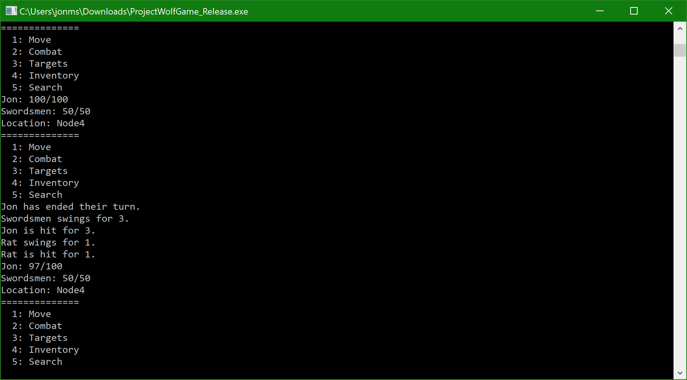

# ProjectWolfGame
A prototype for a terminal-based RPG.

## Tools
* CMAKE

## How to Build
```bash
mkdir build
cd build
cmake ..
# Build and run tests
make all test
```

## Controls

* `12345 - Menu access
* wasdqe - Movement
* i - inventory
* Space - Attack
* t - Change target
* F5 - Save
* F9 - Load

## Screenshot

