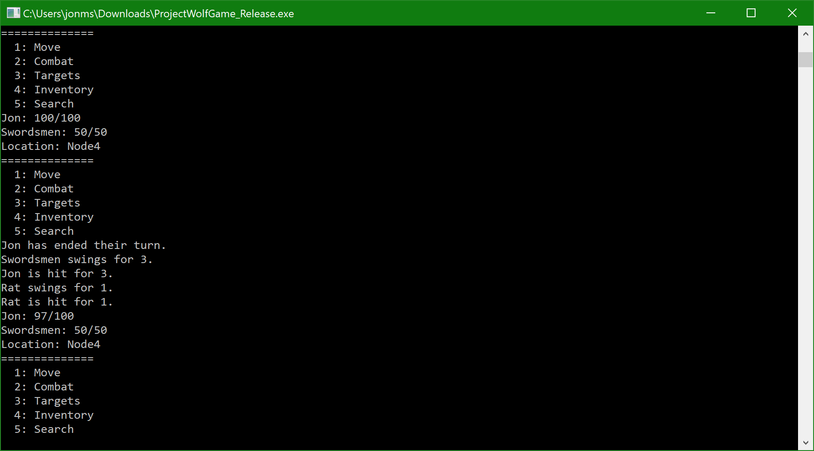

# ProjectWolfGame
A prototype for a terminal-based RPG.

## Tools

* CMake 4.3.1 or newer
* Ninja 1.11 or newer, or Visual Studio
* A C++23 toolchain that can provide `import std`

The sources use `import std;` and have no header fallback, so the standard
library has to be available as a module. That needs three things together:

* **A generator that can scan module dependencies.** Ninja or Visual Studio.
  The Makefile generators cannot, so plain `cmake -S . -B build` will not work.
* **A standard library shipping module sources** -- a `std.cppm` and a
  `libc++.modules.json`, or the libstdc++ equivalent.
* **A compiler shipping `clang-scan-deps`**, which is how CMake works out the
  import graph.

Apple's clang ships the module sources (in `/usr/share/libc++/v1`) but **not**
`clang-scan-deps`, so it cannot build this project. Use an upstream LLVM.
CMake fails at configure time with an explanation if any piece is missing.

## How to Build

```bash
brew install llvm ninja
cmake --preset homebrew-llvm
cmake --build --preset homebrew-llvm
ctest --preset homebrew-llvm
```

`CMakePresets.json` carries the presets: `homebrew-llvm`, `clang` (for an
upstream LLVM already on PATH), and `strict` (warnings as errors). Without a
preset:

```bash
cmake -S . -B build -G Ninja -DCMAKE_CXX_COMPILER=$(brew --prefix llvm)/bin/clang++
cmake --build build
ctest --test-dir build
```

### In an IDE

CLion and other IDEs default to the system compiler, which on macOS is Apple's
clang -- and that cannot build this project. Select one of the presets above in
the IDE's CMake settings, or set the toolchain's C++ compiler to
`$(brew --prefix llvm)/bin/clang++` by hand. Configuring with the wrong
compiler fails with a message saying so.

Elsewhere, any Ninja plus a module-capable compiler will do:

```bash
cmake -S . -B build -G Ninja -DCMAKE_CXX_COMPILER=clang++
cmake --build build
ctest --test-dir build
```

Configuring reports what it found:

```
-- import std: linking libc++ from /opt/homebrew/opt/llvm/lib/c++
-- import std: using /opt/homebrew/opt/llvm/lib/c++/libc++.modules.json
```

Two things are handled for you, and both can be overridden on the command line:

* CMake locates the module metadata by running the compiler with
  `-print-file-name`, without any of this project's flags, so it does not find
  a libc++ that is not the compiler's default. The build looks next to the
  compiler instead. Override with `-DCMAKE_CXX_STDLIB_MODULES_JSON=...`.
* The `std` module is built from the compiler's own libc++, but the linker
  reaches for the platform's by default -- on macOS that silently pairs
  Homebrew's headers with Apple's `/usr/lib/libc++.1.dylib`. The build adds the
  matching `-L` and `-rpath` so both come from one place.

`import std` is still behind an experimental gate in CMake, and the gate value
changes between CMake releases. `CMakeLists.txt` knows the values for **4.3**
and **4.4** and picks by version. On any other release the gate cannot open, and
configuring stops with a message pointing at
`CMAKE_EXPERIMENTAL_CXX_IMPORT_STD` in that version's
`Help/dev/experimental.rst`, whose value needs adding there.

## Modules

The project's own code is modules too, not just `import std`. There are no
public headers: game code and tests write

```cpp
import Engine;
```

`Savable` and `Engine` are named modules matching the two libraries. `Engine`
is split into partitions, one per type, so each file maps to what used to be a
header:

```
Engine.cppm          the primary interface unit; re-exports the partitions
                     and Savable, so `import Engine;` is enough
Fwd.cppm             Engine:Fwd -- forward declarations shared by partitions
                     that only need to name a type
Entity/Actor.cppm    Engine:Actor,  Entity/Actor.cpp  -- implementation unit
Map/Node.cppm        Engine:Node,   ...
```

`:Node` names `Actor` through `:Fwd` rather than importing `:Actor`, because
`:Actor` imports `:Node` for the complete type and a partition dependency
cycle is not allowed.

Three headers survive, and all three exist only because **macros are not
exported by modules**:

| Header | Holds |
| --- | --- |
| `Engine/Creation/Creatable.h` | `CREATABLE_ITEM`, `CREATABLE_REGISTRATION`, ... |
| `Savable/SavableMacros.h` | `SAVE`, `LOAD`, `SAVABLE`, `SAVABLE_CLEAR` |

Game code that registers a class with the factory therefore includes one
header alongside the import:

```cpp
#include <Creation/Creatable.h>

import std;
import Engine;

class Rat : public Actor {
public:
  CREATABLE_ACTOR(Rat)
  Rat() { setName("Rat"); setMaxHealth(2); }
};

CREATABLE_REGISTRATION(Rat);
```

A macro that a module unit needs for its own declarations is included in that
unit's global module fragment, before `export module`.

## Controls

* `12345` - Menu access
* `wasdqe` - Movement
* `i` - Inventory
* `Space` - Attack
* `t` - Change target
* `Enter` - End turn
* `S` - Save
* `L` - Load

## Screenshot

